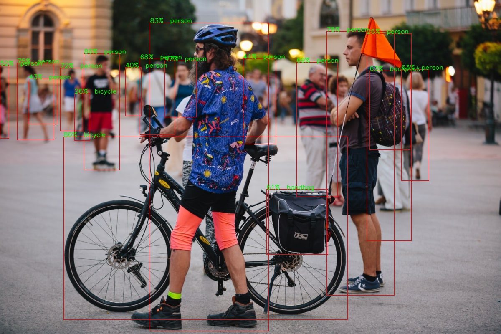

# HR-Depth: High Resolution Self-Supervised Monocular Depth Estimation
This repository contains an executable demonstration of YOLO and Tensorflow implementation for image detection.

## 1. Requirements Installation
Inside the directory containing the cloned repo, install the necessary packages in [requirements.txt](https://github.com/berezerker/YOLO_cv_HSE/blob/main/demo/requirements.txt)

```bash
pip install -r requirements.txt
```
## 2. Downloading Trained Models

The trained model can be downloaded either by executing the download.sh script, or by manually downloading, using the link situated inside the download.sh.
The model used in this work is situated in resources/saved_model_416x416/, the name of the file with weights is model_float16_quant.tflite. Only this file is needed for execution.

## 3.  YOLOV5 Execution in Python

To execute the model, the test_image has to be given as an argument in console, same as the model weights as follows:
```bash
python demo.py
```
If you want to specify another model or another image, you can use arguments as follows:
```bash
python demo.py -i image_name.jpg -w model_name.tflite
```
As a result, the following should appear in the console chat:
```bash
Namespace(weights='model_float16_quant.tflite', img_path='image_test.jpeg', img_size=416, conf_thres=0.25, iou_thres=0.45)
FPS: 1.135766217005526
Total Time Taken: 0.8804628849029541
```
Also, the output image should appear inside the demo/ folder.

## Here is the example of resulting image.


